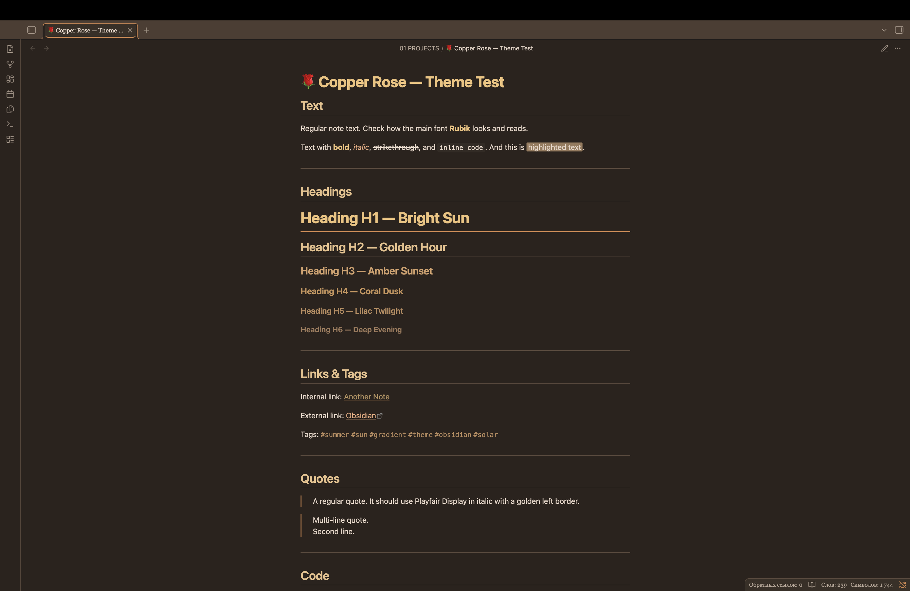
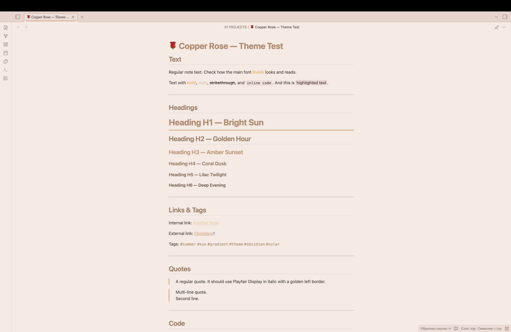

# 🌹 Copper Rose — тема для Obsidian

Тёплая, уютная осенняя тема для [Obsidian](https://obsidian.md) с мягкими розовыми оттенками и золотисто-медными акцентами.

---

## 📑 Оглавление

- [✨ Особенности](#features)
- [📸 Скриншоты](#screenshots)
- [📦 Установка](#installation)
- [🎨 Цветовая палитра](#color-palette)
- [🛠️ Настройка](#customization)
- [📝 Благодарности](#credits)

---

<a id="features"></a>

## ✨ Особенности

- 🎨 Тёплая осенняя цветовая палитра в медно-розовых тонах
- 🌓 Поддержка тёмной и светлой темы
- 🌸 Мягкий розовый фон в светлой теме для комфортного чтения
- 📝 Книжная типографика со шрифтами Georgia и Playfair Display
- 🎯 Контрастность соответствует стандартам WCAG для доступности
- ✨ Жёстко заданные акцентные цвета, которые переопределяют настройки пользователя
- 🍂 Кастомные элементы: теги, чекбоксы, цитаты и сворачиваемые блоки
- 🖊️ Плавные анимации и переходы

---

<a id="screenshots"></a>

## 📸 Скриншоты

### Тёмная тема



### Светлая тема

## 

<a id="installation"></a>

## 📦 Установка

### Из магазина тем Obsidian

1. Открой настройки Obsidian
2. Перейди в **Оформление** → **Темы** → **Управление**
3. [Copper Rose](https://community.obsidian.md/themes/copper-rose)
4. Нажми **Установить**, затем **Применить**

### Ручная установка

1. Скачай файлы `theme.css` и `manifest.json`
2. Создай папку `Copper Rose` в каталоге `.obsidian/themes/`
3. Помести туда оба файла
4. Включи тему в настройках Obsidian: **Оформление** → **Темы**

---

<a id="color-palette"></a>

## 🎨 Цветовая палитра

### Тёмная тема

| Элемент   | Цвет      | Описание                  |
| --------- | --------- | ------------------------- |
| Фон       | `#2b231d` | Тёплый тёмно-коричневый   |
| Текст     | `#e8d6c8` | Кремовый                  |
| Акцент    | `#d4874c` | Медно-оранжевый           |
| Подсветка | `#f0c27a` | Золотой                   |
| Теги      | `#d4a373` | Песочный (прозрачный фон) |

### Светлая тема

| Элемент   | Цвет      | Описание                |
| --------- | --------- | ----------------------- |
| Фон       | `#f0e4d4` | Тёплый латте            |
| Текст     | `#3a2e22` | Тёплый тёмно-коричневый |
| Акцент    | `#a07a5a` | Корица                  |
| Подсветка | `#b88a5c` | Медный                  |
| Теги      | `#b88a5c` | Медный (прозрачный фон) |

---

<a id="customization"></a>

## 🛠️ Настройка

### Изменение цветов

Ты можешь изменить цвета, отредактировав CSS-переменные в файле `theme.css`:

```css
--autumn-gold: #f0c27a; /* Измени на свой золотой */
--autumn-orange: #d4874c; /* Измени на свой оранжевый */
--autumn-terracotta: #b5653b; /* Измени на свою терракоту */
```

### Рекомендуемый акцентный цвет

Для наилучшего восприятия установи в Obsidian акцентный цвет:

- RGB: 212, 135, 76
- HEX: #d4874c
  > Примечание: Тема жёстко задаёт акцентные цвета, поэтому настройки пользователя будут переопределены.

---

<a id="ideas"></a>

## 💡 Поделись идеей

Есть идея для новой функции или уютной детали, которую хотелось бы видеть в Copper Rose? Буду рада услышать!

Ты можешь поделиться предложением через:

- 🐛 [Создать issue на GitHub](https://github.com/RamenOfficialGovPatsy/Copper-Rose/issues)
- ✉️ Написать сообщение на [форуме Obsidian](https://forum.obsidian.md)

Твои идеи помогают сделать тему уютнее для всех! 🌹🍂

---

<a id="credits"></a>

## 📝 Благодарности

- Вдохновлена осенними цветами и уютной атмосферой для чтения
- Типографика: Georgia, Playfair Display, JetBrains Mono
- Создана с заботой о комфорте и эстетике
